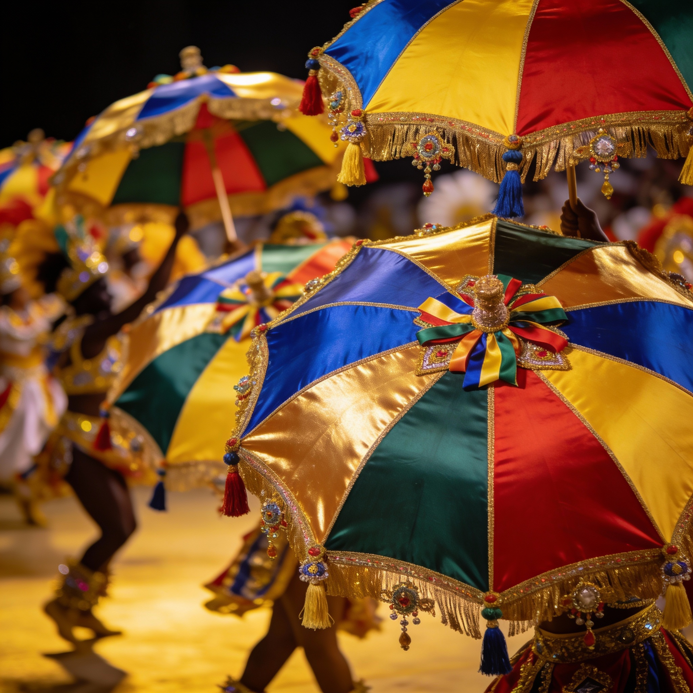
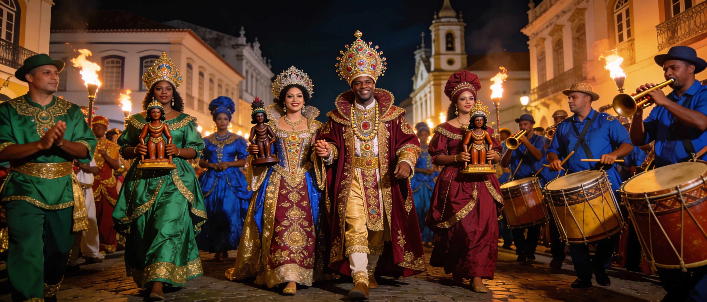
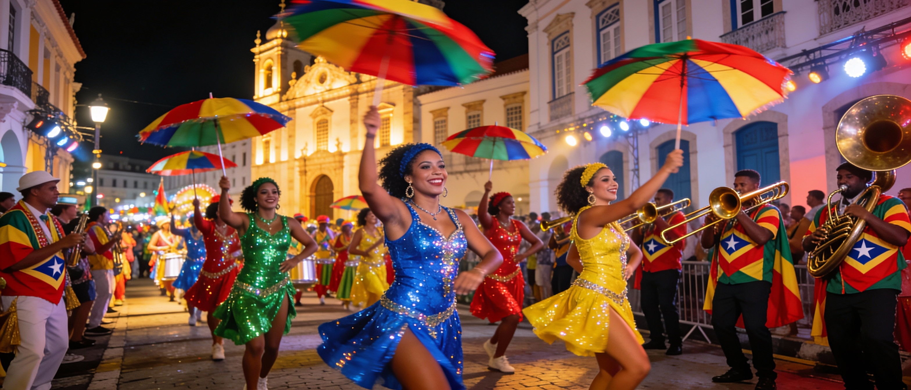
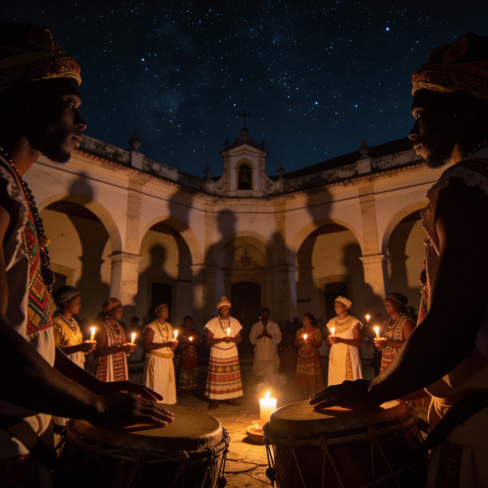

  

<h1 align="center">Frevo</h1>

  <strong>A dark color theme born from Pernambuco's carnival nights.</strong>

  <a href="#the-story">The Story</a> &bull;
  <a href="#philosophy">Philosophy</a> &bull;
  <a href="#palette">Palette</a> &bull;
  <a href="#installation">Installation</a> &bull;
  <a href="#ports">Ports</a> &bull;
  <a href="#contributing">Contributing</a>

  
  
  

---

## The Story

The Pernambuco carnival is a celebration unlike any other in Brazil — a multisensory experience rooted in centuries of African, Indigenous, and Portuguese cultural heritage. Its nights pulse with a unique energy that can only be understood by those who have lived it.

  

### A Democratic Celebration

What radically distinguishes Pernambuco's carnival from other Brazilian festivities is its fundamental **democratization of revelry**. Unlike celebrations that require special costumes or tickets, Recife's carnival invites revelers from all social classes to take to the streets dressed however they please, without needing to belong to any specific school or association. This inclusivity is not accidental — it is the result of a colonial tradition of relative tolerance for street manifestations that has consolidated over time as a deep cultural value.

### The Vibrant Colors

  

The chromatic palette of Pernambuco's carnival carries profound symbolic meaning, most iconically materialized in the **frevo umbrellas**. These small ornamental parasols are not mere accessories but living symbols of Pernambucano cultural identity. The colors that dominate the umbrellas — **blue, green, yellow, and red** — correspond exactly to the colors of the state flag, creating an immediate visual connection between the celebration and territorial identity.

Colors appear in saturated intensity during carnival nights, amplified by stage lighting spread across the seven main poles of Recife Antigo and Santo Antônio. Sequins, glitter, tulle, and all manner of extravagant materials adorn the revelers' bodies, creating a visual explosion of refracted luminosity.

### Frevo: Brass and Frenetic Dance

Frevo is the most energetic and visceral musical manifestation of Pernambuco's carnival. Musically, it results from the fusion of march, maxixe, and classical music elements, combined with the influence of military bands that played in Pernambuco's streets. Its essential characteristic is a **rapid tempo and contagious groove** that compels the body to move involuntarily.

The instrumentation is dominated by **brass and percussion orchestras**, with wind instruments as the undisputed protagonists. Trumpets, trombones, tubas, and saxophones execute rapid melodic lines full of variations, creating a unique, festive, and explosive sound. The "pressure of the brass instruments" in frevo is described as something unique, possessing "absurd energy."

Frevo dancers execute highly technical acrobatic movements — **jumps, pirouettes, and continuous spins** — while manipulating their umbrellas so that they function simultaneously as an extension of the body and as an instrument of artistic expression.

### Maracatu: Spirituality and Ancestry

  

Maracatu represents a manifestation deeply rooted in the Afro-Brazilian history of Pernambuco. **Maracatu Nação**, the oldest form, is characterized by the representation of a royal procession accompanied by a percussion group. It ritualistically enacts the coronation of Congo kings, combining magical and religious elements that connect directly to terreiro religions — Candomblé, Xangô, Jurema, and Umbanda.

The music is characterized by the **baque virado**, a rhythm that constitutes the central element of its musicality. This syncopated pattern presents strong accentuation on the bass drums (alfaias) with responses on higher-pitched instruments (agbês and snare drums), creating a dense, striking, and ceremonial rhythm.

The **Night of the Silent Drums**, held on carnival Monday at Pátio do Terço, represents a moment of radical transformation in the celebration. Precisely at midnight, the lights of the São José neighborhood go out and all drums fall silent in reverence to Our Lady of the Rosary, patron saint of Black people, and Saint Benedict. In this sacred moment, chants in Jeje-Nagô — the ritual language of Candomblé — echo in the darkness, honoring African ancestors and reaffirming the Afro-Brazilian origins of maracatu.

### From Streets to Screen

This theme captures the essence of Pernambuco's carnival nights — the warm glow of street lights against the deep blue evening sky, the flash of colorful costumes, and the electric energy that fills the air when the frevo music plays.

Each color was chosen not just for accessibility and readability, but to evoke the spirit of one of Brazil's most vibrant cultural expressions. The blues of twilight over Recife, the gold of frevo umbrellas, the deep ceremonial rhythms visualized in rich purples and greens — all condensed into seven carefully balanced syntax colors that bring that energy to your editor.

---

## Philosophy

Most color themes fall into one of two camps: **vibrant but tiring**, or **muted but dull**. Frevo takes a different approach.

### Selective Vibrancy

Instead of making everything colorful, we use just **7 syntax colors** against restrained backgrounds. Your code pops; the UI stays quiet. After a few hours, you stop seeing colors and start seeing _meaning_.

### Perceptual Consistency

Colors are defined in **OKLCH**, a color space that matches human perception. When we say two colors have the same lightness, they actually _look_ equally bright. No more squinting at dark blues next to bright yellows.

### Accessibility First

Every color combination meets **WCAG 2.2 AA** standards. The palette was tested for deuteranopia, protanopia, and tritanopia. We never rely on hue alone — luminance differences ensure distinguishability for everyone.

### OLED Friendly

No pure black (`#000000`). The dark backgrounds have a subtle blue tint that prevents the "haloing" effect on OLED screens and reduces eye strain during long sessions.

> **Want the technical details?** See [The Frevo Palette](docs/PALETTE.md) for the full story of how each color was chosen.

---

## Palette

<table>
  <tr>
    <td align="center"> <strong>Blue</strong> <code>#4B9AFF</code></td>
    <td align="center"> <strong>Purple</strong> <code>#D966FF</code></td>
    <td align="center"> <strong>Cyan</strong> <code>#00A3E5</code></td>
    <td align="center"> <strong>Green</strong> <code>#7AD96A</code></td>
  </tr>
  <tr>
    <td align="center"> <strong>Yellow</strong> <code>#F0B000</code></td>
    <td align="center"> <strong>Orange</strong> <code>#FF6700</code></td>
    <td align="center"> <strong>Red</strong> <code>#FF5B5F</code></td>
    <td align="center"> <strong>Background</strong> <code>#1A1F2E</code></td>
  </tr>
</table>

> See the complete [Palette Reference](docs/PALETTE.md) for all colors, contrast ratios, OKLCH values, and the reasoning behind each choice.

---

## Installation

### Editors

| Application   | Install                                                      |
| ------------- | ------------------------------------------------------------ |
| **Neovim**    | `{ "renatobarros/frevo.nvim" }` with lazy.nvim               |
| **VS Code**   | Copy theme to extensions folder                              |
| **JetBrains** | Import `frevo.icls` in color settings                        |
| **Kate**      | Copy to `~/.local/share/org.kde.syntax-highlighting/themes/` |

### Terminals

| Application   | Install                                         |
| ------------- | ----------------------------------------------- |
| **Kitty**     | `include frevo.conf` in kitty.conf              |
| **Alacritty** | `import = ["frevo.toml"]` in alacritty.toml     |
| **iTerm2**    | Import `frevo.itermcolors` in Profiles > Colors |
| **Ghostty**   | Copy `frevo.conf` to config directory           |

### Desktop (Linux)

| Application   | Install                   |
| ------------- | ------------------------- |
| **Hyprland**  | `source = frevo.conf`     |
| **Waybar**    | `@import "frevo.css"`     |
| **Rofi/Wofi** | Use as theme file         |
| **Dunst**     | Merge colors into dunstrc |

> **Full instructions**: See [Installation Guide](docs/INSTALL.md) for detailed steps for all 35+ supported applications.

---

## Ports

Frevo is available for **35+ applications**:

| Category      | Applications                                 |
| ------------- | -------------------------------------------- |
| **Editors**   | Neovim, VS Code, JetBrains, Kate             |
| **Terminals** | Kitty, Alacritty, iTerm2, Ghostty            |
| **Desktop**   | Hyprland, Waybar, Rofi, Wofi, Dunst, GTK, Qt |
| **Shells**    | Fish, Zsh, Starship, Tmux                    |
| **Browsers**  | Firefox (userChrome), Chrome                 |
| **Apps**      | Slack, Todoist, qBittorrent, Calibre         |
| **Creative**  | Figma, GIMP, FreeCAD, KiCad                  |
| **Dev Tools** | GitHub, OpenCode                             |

> See [Available Ports](docs/PORTS.md) for the complete list with links.

---

## Documentation

| Document                                   | Description                                   |
| ------------------------------------------ | --------------------------------------------- |
| [The Frevo Palette](docs/PALETTE.md)       | How we chose the colors — theory and practice |
| [Installation Guide](docs/INSTALL.md)      | Step-by-step setup for all applications       |
| [Available Ports](docs/PORTS.md)           | Status of all 35+ ports                       |
| [Contributing Guide](docs/CONTRIBUTING.md) | How to contribute                             |

---

## Contributing

Contributions are welcome! You can:

- **Create a port** for a new application
- **Report issues** or suggest improvements
- **Improve documentation**
- **Share screenshots** of your setup

Please read the [Contributing Guide](docs/CONTRIBUTING.md) first.

---

## License

[MIT](LICENSE) - 2025 Renato Barros

---

  Made with care in Pernambuco, Brazil

